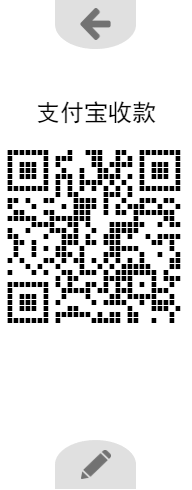
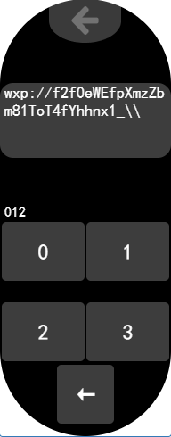

# 小米手环7增强版表盘
## 功能介绍
### 1.表盘背景随时间变化(开发中)

表盘的背景是在同一个地点拍摄的一天24小时不同的照片，随时间变化，只需看一眼表盘即可大概了解现在是在晚上还是在下午。而且部分前景还会覆盖部分控件，形成层次感。

____
### 2.微信/支付宝收款码生成
进入菜单，选择微信或支付宝收款码，点击下方的编辑按钮，可将你的相应收款码编码到手环中，并显示为二维码，在收款时，只需要点三下手表即可收款，方便快捷，建议手表同时开启接收手机通知功能，手机收到收款能第一时间看到。

*如何获取收款码？*

下载您的收款码，用二维码识别软件识别内容。
____
### 3.点数器
点一下屏幕+1,同时带有震动反馈，适合特定行业的人员使用（如空乘服务人员）

____
### 4.吃什么决策器
不知道吃什么好？用这个功能决定吧，内置100+快餐和正餐选择，还能统计选择的次数。

____

### 5.更多信息显示
- 月相图(开发中)
- 微型尺子(已完成)
- 电量和蓝牙状态显示（排期中）
- 心跳显示（排期中）

## 如何安装？(尚未发布)
下载表盘文件：
https://gitee.com/antonioliang/mi7_watchface_plus/releases

使用米坛社区的工具导入到您的小米手环7中：

https://www.bandbbs.cn/threads/3989/

https://www.bandbbs.cn/threads/3969/

安装完毕后，如果平时要使用收款码，请提前设置好并测试是否本人的收款码
____
## 手环模拟器
感谢@GiveMeFive 开发的手环模拟器：

https://www.bandbbs.cn/threads/4060/

## 关于背景图
背景图是游戏《荒野大镖客2》中的游戏截图。

## 关于二维码生成
二维码生成调用了@davidshimjs/qrcodejs 的相关代码

https://github.com/davidshimjs/qrcodejs

为了省空间，只保留了使用到的代码,删除了画布绘制相关的代码，采用方块字符模拟点阵进行绘制，绘制时需要获取二维码的行列数量，并计算相应的字符大小和文本框尺寸，相关逻辑可参照代码所示。

## 关于键盘
由于手环触控面积小，必须设计一个新的输入法来输入字符，来让用户能够精确地输入，我采用Ascii码表对照，用四位四进制字符制作了如图所示的输入法，共五个按键，分别为0-3的四进制按键和一个退格按键，通过四进制按键输入下表对应的四进制代码，可输入相应的字符，如果输错了，按退格键退格。

*字符对照表*
|Ascii码|字符|四进制码|Ascii码|字符|四进制码|Ascii码|字符|四进制码|
|--|--|--|--|--|--|--|--|--|
|32|空格|0200|65|A|1001|97|a|1201|
|33|!|0201|66|B|1002|98|b|1202|
|34|"|0202|67|C|1003|99|c|1203|
|35|#|0203|68|D|1010|100|d|1210|
|36|$|0210|69|E|1011|101|e|1211|
|37|%|0211|70|F|1012|102|f|1212|
|38|&|0212|71|G|1013|103|g|1213|
|39|'|0213|72|H|1020|104|h|1220|
|40|(|0220|73|I|1021|105|i|1221|
|41|)|0221|74|J|1022|106|j|1222|
|42|*|0222|75|K|1023|107|k|1223|
|43|+|0223|76|L|1030|108|l|1230|
|44|,|0230|77|M|1031|109|m|1231|
|45|-|0231|78|N|1032|110|n|1232|
|46|.|0232|79|O|1033|111|o|1233|
|47|/|0233|80|P|1100|112|p|1300|
|48|0|0300|81|Q|1101|113|q|1301|
|49|1|0301|82|R|1102|114|r|1302|
|50|2|0302|83|S|1103|115|s|1303|
|51|3|0303|84|T|1110|116|t|1310|
|52|4|0310|85|U|1111|117|u|1311|
|53|5|0311|86|V|1112|118|v|1312|
|54|6|0312|87|W|1113|119|w|1313|
|55|7|0313|88|X|1120|120|x|1320|
|56|8|0320|89|Y|1121|121|y|1321|
|57|9|0321|90|Z|1122|122|z|1322|
|58|:|0322|||||||
|59|;|0323|||||||
|60|<|0330|||||||
|61|=|0331|||||||
|62|>|0332|||||||
|63|?|0333|||||||
|64|@|1000|||||||
|91|[|1123|||||||
|92|\\ |1130|||||||
|93|]|1131|||||||
|94|^|1132|||||||
|95|_|1133|||||||
|96|`|1200|||||||
|123|{|1323|||||||
|124|\||1330|||||||
|125|}|1331|||||||
|126|~|1332|||||||

## 关于捐赠与合作
如果您觉得这款表盘好用，在生活和工作上能帮到您，欢迎给我打赏，收款码在上方已给出，头像为美元头像。

如果您有表盘定制的需求或其他软件定制需求，也欢迎联系我，我将竭尽所能为您服务。

## 关于代码质量
由于时间仓促，代码会一些BUG和写得不合理的地方，望大家多多担待，我将会在日后的开发中逐渐完善和优化代码，以及UI。

## 视频演示
将会发布在B站