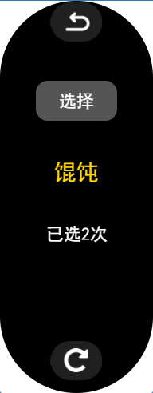

# 小米手环7增强版表盘
## 功能介绍
### 1.表盘背景随时间变化

表盘的背景是在同一个地点拍摄的一天24小时不同的照片，随时间变化，只需看一眼表盘即可大概了解现在是在晚上还是在下午。而且部分前景还会覆盖部分控件，形成层次感。

____
### 2.微信/支付宝收款码生成(开发中)
进入菜单，选择微信或支付宝收款码，点击下方的编辑按钮，可将你的相应收款码编码到手环中，并显示为二维码，在收款时，只需要点三下手表即可收款，方便快捷，建议手表同时开启接收手机通知功能，手机收到收款能第一时间看到。
____
### 3.点数器
点一下屏幕+1,同时带有震动反馈，适合特定行业的人员使用（如空乘服务人员）

____
### 4.吃什么决策器
不知道吃什么好？用这个功能决定吧，内置100+快餐和正餐选择，还能统计选择的次数。

____

### 5.更多信息显示
- 月相图
- 微型尺子

## 如何安装？
下载表盘文件：
https://gitee.com/antonioliang/mi7_watchface_plus/releases

使用米坛社区的工具导入到您的小米手环7中：

https://www.bandbbs.cn/threads/3989/

https://www.bandbbs.cn/threads/3969/

安装完毕后，如果平时要使用收款码，请提前设置好并测试是否本人的收款码
____
## 手环模拟器
感谢@GiveMeFive 开发的手环模拟器：

https://www.bandbbs.cn/threads/4060/

## 关于背景图
背景图是游戏《荒野大镖客2》中的游戏截图。
